# Enhanced Trigger Box

The Enhanced Trigger Box is a free tool that can be used within Unity. It allows developers to set up various responses to be executed when an object enters a specified area. Developers can also set up conditions that must be met before the responses are executed, such as camera conditions where, for example, a player must not be looking at a specific object, or player preference conditions, such as progress through a level. Responses are executed after all conditions have been met. These range from spawning GameObjects or disabling components to playing animations or altering material properties.

It has been designed in a way that allows you to easily extend the Enhanced Trigger Box yourself by adding more responses or conditions. This will be explained in more detail further down the page.

_Current version: [v0.5]_

## Getting started

To begin, download the asset from the asset store and import it into your project. Alternatively, you can download the zip file from GitHub and place it in your project. From there, you can open the example scene and explore it.

To add a new Enhanced Trigger Box, use the prefab located in the Prefabs folder. From there, you can add any conditions or responses using the drop-down lists.

Please note that the example scene in this version of the Enhanced Trigger Box (ETB) has been built with Unity 6.0 and is not guaranteed to work with significantly older or newer versions of the engine. However, the script itself will work in any engine version from Unity 5.0 onward.

The examples directory is optional. If you have no desire to explore it or are concerned about engine incompatibilities, you do not need to import that directory. Instead, you can simply import the scripts directory.

### Demo Scene Overview

This scene contains a combination of various conditions and responses. All you have to do is explore. The Enhanced Trigger Box is used quite excessively here, and you wouldn't normally use it this way as a lot of instantiating and destroying is happening. However, it gives you an idea of what you can do.

Note: The demo scene has been removed in the latest version due to dependencies on older versions of Unity.

[Here's a video of the demo scene as of v0.1.0.](https://youtu.be/MIJ6kTY1X4c)

### Examples Scene Overview

This scene showcases most of the conditions and responses, one at a time, giving you an idea of what they do. To activate a response, simply walk into the box. To test a condition, walk into the box and meet the condition. For example, for the Looking Away condition, don't look at the cube in front of you. The cube will turn a different colour when the box is successfully triggered, and it will also send a message to the console.

[Here's a video of the examples scene as of v0.1.0.](https://youtu.be/bjobfHm6cas)

## How it all works

At the top level, you have the Enhanced Trigger Box script. It includes some basic options and uses a box collider to represent the boundaries of the Enhanced Trigger Box. Beneath that, you have Enhanced Trigger Box Components, which are MonoBehaviours that you can add to the Enhanced Trigger Box. These come in the form of either a Condition or a Response and are located in the `Scripts/TriggerBoxComponents` folder.

When an Enhanced Trigger Box is entered by another object with a collider (you can disable this entry check if you want, and it will be treated as 'entered' on initialization), all the conditions are checked to see if each condition has been met. If all the conditions are met, all the responses are executed.

If you click on one of the Enhanced Trigger Boxes in the scene, drag the ETB prefab from the Prefabs folder, or add the EnhancedTriggerBox script to a GameObject, you can see what the script looks like in the inspector.

### Base Options Overview

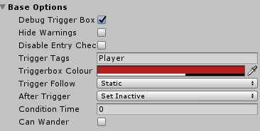

**Debug Trigger Box**: If true, the script will write to the console when certain events happen, such as when the trigger box is triggered.

**Hide Warnings**: If true, the script won't perform checks to notify you if you're missing any required references or if there are any errors.

**Disable Entry Check**: If true, the entry check on the trigger box will be disabled, meaning it will go straight to condition checking instead of waiting for something to enter the trigger box.

**Trigger Tags**: Only GameObjects with tags listed here can trigger the trigger box. To have more than one tag, separate them with commas. If you leave this field blank, any object will be able to trigger it.

**Trigger Box Colour**: This is the color the trigger box and its edges will have in the editor.

**Trigger Follow**: This allows you to choose whether you want your trigger box to stay positioned on a moving transform or the main camera. If you pick Follow Transform, a field will appear to set which transform you want the trigger box to follow. If you pick Follow Main Camera, the trigger box will stay positioned wherever the main camera currently is.

**After Trigger**: This allows you to choose what happens to the GameObject after the trigger box has been triggered. Options include:

- **Set Inactive**: Sets the GameObject as inactive.

- **Destroy Trigger Box**: Destroys the GameObject.

- **Destroy Parent**: Destroys the GameObject's parent.

- **Do Nothing**: The trigger box will stay active and continue to operate.

**Execute Exit Responses**: Allows you to set up additional responses to be executed after the object that entered the trigger box leaves it.

**Condition Time**: This sets an additional time requirement on top of the conditions. It specifies the total time that the conditions must be met in seconds.

**Can Wander**: If true, condition checks will continue taking place if the user leaves the trigger box area. If false, if the user leaves the trigger box and all conditions haven't been met, it will stop doing condition checks.

### Conditions Overview

After the base options, there is a divider, followed by a list of all the conditions added to this Enhanced Trigger Box. If you have added a blank copy from the Prefabs folder, you will not see any conditions.

Beneath the list of conditions (or if there are no conditions, this is the only thing you can see) is a drop-down list called Add A New Condition. This drop-down list contains all the available conditions that you can add. You can add as many conditions as you want.

Selecting a condition from this list will add it to the Enhanced Trigger Box, and you will see it above the Add A New Condition drop-down list. The structure of each component will be different, and each will be explained in detail later down the page.

You have now added a condition. When this Enhanced Trigger Box is entered, this condition will be checked and must pass before any responses are executed. Each condition will have various options that affect how the condition is met. To remove a condition, click the X in the top right of the component.

### Responses Overview

Below the conditions section is the responses section. Similarly, there is a drop-down list that displays all available responses which you can add to this Enhanced Trigger Box.

Each response will perform a different action and will only be executed when all conditions have been met, in the order that they are listed.

### Exit Responses Overview

If you set **After Trigger** to **Execute Exit Responses**, you'll have access to a third section that displays all active exit responses and allows you to add more. Exit responses are similar to responses, but instead of executing when a GameObject enters the trigger box, they get executed when the GameObject leaves the trigger box.

After the GameObject leaves the trigger box and the exit responses are executed, the trigger box will revert to an untriggered state, allowing it to be initially triggered by other GameObjects. Only the GameObject that entered the trigger box can trigger the leave event.

## Creating a new Component

Creating a new Condition or Response is relatively straightforward. Open `NewComponentExample.cs` in `Scripts/TriggerBoxComponents`. You can use this example as a template for new components.

To create a new component, inherit from `ConditionComponent` or `ResponseComponent` (depending on whether the new component is a condition or response), make sure it is in the Enhanced Trigger Box namespace, and then override some functions. There are five functions you can override: one is mandatory, one is recommended, and the other three are optional. These will be explained in detail below.

If you want to view more advanced examples, go to `Scripts/TriggerBoxComponents/Conditions` or `Scripts/TriggerBoxComponents/Responses` and take a look at some of them.

#### Inherit ConditionComponent or ResponseComponent

The most important thing is to inherit ConditionComponent or ResponseComponent in the class definition and ensure the class is within the EnhancedTriggerbox.Component namespace. It's also recommended to add `[AddComponentMenu("")]` above the class name. This attribute means you won't see it in the Add Component Menu, and it unfortunately can't be passed down by inheritance, so it must be added manually.

```csharp
namespace EnhancedTriggerbox.Component
{
	[AddComponentMenu("")]
	public class NewComponentExample : ConditionComponent { }
}
```

Below that, you can declare the variables you will be using for your component as usual.

```csharp
public GameObject exampleGameobject;
```

#### DrawInspectorGUI()

It is recommended to override DrawInspectorGUI(). This function deals with drawing the GUI, i.e., what your component will look like in the inspector. If you do not override this function, the base function will draw it for you with certain limitations. These limitations include not being able to use custom structs or enums and not being able to add your own tooltips. If you choose to override this function, make sure you encapsulate it within the #if UNITY_EDITOR tags, as this is editor-related code.

Here's how you would draw a GameObject in the inspector:

```csharp
#if UNITY_EDITOR
public override void DrawInspectorGUI()
{
    exampleGameObject = (GameObject)UnityEditor.EditorGUILayout.ObjectField(
        new GUIContent("Example GameObject", "Example tooltip"),
        exampleGameObject,
        typeof(GameObject),
        true
    );

    exampleBool = UnityEditor.EditorGUILayout.Toggle(
        new GUIContent("Example Bool", "Example tooltip"),
        exampleBool
    );

    exampleInt = UnityEditor.EditorGUILayout.IntField(
        new GUIContent("Example Int", "Example tooltip"),
        exampleInt
    );

    exampleString = UnityEditor.EditorGUILayout.TextField(
        new GUIContent("Example String", "Example tooltip"),
        exampleString
    );

    exampleEnum = (EnumName)UnityEditor.EditorGUILayout.EnumPopup(
        new GUIContent("Example Enum", "Example tooltip"),
        exampleEnum
    );
}
#endif
```

UnityEditor.EditorGUILayout.ObjectField is the typical object reference field you always see in Unity. It returns the object, which we need to save as `exampleGameObject`, so we do `exampleGameObject = ObjectField`. Notice the `(GameObject)` before `UnityEditor.EditorGUILayout`? This is because the `ObjectField` returns an object, not a GameObject, so we must explicitly convert it to a GameObject.

For the first part of the object field, we'll create a new `GUIContent` which will hold the field name (label before the field) and field tooltip (text displayed on hover). After that, we pass in `exampleGameObject` again, as the `ObjectField` needs the current object there so it is displayed correctly. Then we set the type, which in this case is `GameObject`. The final true allows the user to use GameObjects currently in the scene, which we want, so set it to `true`.

Below the GameObject example are other examples of how you would add your variables to the inspector, including bools, ints, strings, and enums. For more information about using EditorGUILayout, click [here](https://docs.unity3d.com/ScriptReference/EditorGUILayout.html).

#### ExecuteAction()

`ExecuteAction()` must be overridden. If this component is a condition, this function is called when the trigger box is entered (a GameObject enters it) and must return `true` or `false` depending on whether the condition has been met. If this component is a response, then this function is called when all conditions have been met and returns `true` or `false` depending on whether the response has executed correctly. In the first code block, you can see a basic `ExecuteAction()` example for a condition. If something has been done, return `true` and then the responses can start executing. In the second code block, you can see a basic `ExecuteAction()` for a response.

```csharp
public override bool ExecuteAction()
{
	// Basic conditional if statement
	if (exampleInt > 5)
		return true;
	else
		return false;
}
```

```csharp
public override bool ExecuteAction()
{
	// Very basic response
	exampleInt = 0;
	return true;
}
```

If your response takes some time to fully execute, you should use the duration variable (from the EnhancedTriggerBoxComponent class) to tell the main script to wait for it to finish before deactivating/destroying the trigger box. For a usage example, look in the lighting response at the ChangeLightColourOverTime() coroutine.

You can also override an overload function for `ExecuteAction`: `ExecuteAction(GameObject collisionGameObject)`. This overload provides you with access to the `GameObject` that collided with the trigger box, allowing you to manipulate it as you wish.

However, you must tell the Enhanced Trigger Box that you are using the function with the collision data over the function without it. To do this, you need to override the variable `requiresCollisionObjectData` and set it to true. Below is an example of usage of the overload function as well as how you would override the variable.

```csharp
public override bool requiresCollisionObjectData
{
    get
    {
        return true;
    }
}

public override bool ExecuteAction(GameObject collisionGameObject)
{
	collisionGameObject.GetComponent<MeshRenderer>().material.SetColor(propertyName, propertyColour);
}
```

#### OnAwake()

`OnAwake()` is an optional function that you can override. This function is called when the game first starts or when the Enhanced Trigger Box gets initialized. You can place whatever you want in here, and it will be executed at the start of the game or upon initialization of the Enhanced Trigger Box. The most common uses include caching components or objects and retrieving updated values.

```csharp
public override void OnAwake()
{
	exampleBoxCollider = targetObject.GetComponent<BoxCollider>();
	float.TryParse(PlayerPrefs.GetString("PlayerPrefKey"), out examplePlayerPref);
}
```

#### Validation()

`Validation()` is an optional function that you can override. This function is called multiple times per frame in the editor after the Enhanced Trigger Box GUI gets drawn. You should use it for displaying warnings about your component, such as missing references or invalid values. To display a warning, use `ShowWarningMessage("Your warning")`. This will take into account whether the user has disabled warnings in the base options.

```csharp
public override void Validation()
{
    if (!exampleGameObject)
    {
        ShowWarningMessage("WARNING: You haven't assigned an object to exampleGameObject.");
    }
}
```

Now you can add your new component as a condition or response in the editor! Because it inherits from `ConditionComponent` or `ResponseComponent`, it will follow all the same rules as the other components, and functions will be called when they're supposed to.

If you think your new component could be useful to others, send it to me or create a pull request on GitHub, and I'll add it to the asset.

#### ResetComponent()

`ResetComponent()` is an optional function that you can override. The AfterTrigger option in Base Options needs to be set to **DoNothing** or **ExecuteExitResponses** for this function to be called. It is called after all responses have finished executing. This function can be used to reset variables or reacquire data before the trigger box starts checking for triggers again.

## Individual Conditions

Below this, all of the current conditions will be listed and described in detail. Once the trigger box is entered, all the conditions will be checked to see if they have been met. If all conditions have been met, all the responses will be executed.

### Camera Condition

The camera condition can be used to determine if a camera is looking at or not looking at something. To use this condition, simply drag an object onto **Condition Object** and select either **Looking At** or **Looking Away**.

#### How Does the Looking At Condition Type Work?

Once you supply an object for **Condition Object**, you can select the component parameter that the condition will work with. For example, **Transform** will mean the condition can only pass if the transform's position is within the camera planes, or **Full Box Collider** will mean that the entire box collider must be in view.

For Transform, it first transforms the condition object's position from world space into the selected camera's viewport space. It then checks that position to see if it's within the camera's planes using the following if statement:

```csharp
if (viewConditionScreenPoint.z > 0 && viewConditionScreenPoint.x > 0 &&
    viewConditionScreenPoint.x < 1 && viewConditionScreenPoint.y > 0 && viewConditionScreenPoint.y < 1)
```

If this statement is true, then it means the object is in the camera's view. It will then fire a raycast from the camera in the direction of the object to make sure no objects are blocking its view (unless **Ignore Obstacles** is ticked). If that succeeds, it means there was either nothing in the way or it hit our object, and the condition has passed.

If the component parameter is set to **Full Box Collider**, all important points on a box collider must be within the camera's view. Instead of doing the above if statement on just the transform, it does it on all the box collider's points to ensure it is all in view. **Minimum Box Collider** is similar but only one point on the box collider needs to be visible for it to pass.

One thing to note for the **Full Box Collider** is that if you're up close to large objects, the condition could get met unintentionally. Because only important points on the box collider (such as corners and centers) are checked, if you're really close to a big object so that none of those points are in your camera, the condition will get met. A solution to this is to use the **Min Distance** field so that they have to be a certain distance away from the object.

**Mesh Renderer** uses the in-built isVisible function to work out if it is visible in a camera. Note that an object is considered visible when its existence is visible for any reason in the editor. For example, it might not actually be visible by any camera but still need to be rendered for shadows. Also, remember that if the object is visible in the scene window and not the game window, it will still be classed as visible.

**Raycast Intensity** allows you to customize the raycasts that get fired when checking if there's anything blocking the camera's view to the object. Ignore Obstacles won't do any raycast checks at all, meaning you just have to look in the direction of the object, and the condition will pass, even if there's something in the way. Very Low does raycast checks at a maximum of once per second against the object's position. Low does raycast checks at a maximum of once per 0.1 seconds against the object's position. Med does raycast checks once per frame against the object's position. High does raycast checks once per frame against every corner of the box collider.

#### How Does the Looking Away Condition Type Work?

It is essentially the opposite of the **Looking At** condition. For example, with the **Transform** component type, if the object's position is outside of the camera's view frustum, the condition will pass. **Full Box Collider** will pass if the whole box collider is outside of the camera's view. **Minimum Box Collider** will pass if any part of the box collider is outside of the camera's view. **Mesh Renderer** will pass if the `isVisible` function is false.

One thing to note is that it doesn't do any raycast checks. This means that if an object is hidden behind an obstacle, it won't pass if the camera is looking in its direction. This feature will be added shortly.

#### Component fields

**Camera**: This is the camera that will be used for the condition. By default, this is the main camera.

**Condition Type**: This is the type of condition you want. The **Looking At** condition only passes when the user can see a specific transform or GameObject. The **Looking Away** condition only passes when a transform or GameObject is out of the user's camera frustum.

**Condition Object**: This is the object that the condition is based upon.

**Component Parameter**: This is the type of component the condition will be checked against. Options include:

- **Transform**: A single point in space.

- **Minimum Box Collider**: Any part of a box collider.

- **Full Box Collider**: The entire box collider.

- **Mesh Renderer**: Any part of a mesh. For example, with the **Looking At** condition and **Minimum Box Collider**, if any part of the box collider enters the camera's view, the condition is met.

**Raycast Intensity**: When using the **Looking At** condition type, raycasts are fired to make sure nothing is blocking the camera's line of sight to the object. Here you can customize how those raycasts should be fired:

- **Ignore Obstacles**: Fires no raycasts, meaning the condition will pass even if there is an object in the way.

- **Very Low**: Does raycast checks at a maximum of once per second against the object's position.

- **Low**: Does raycast checks at a maximum of once per 0.1 seconds against the object's position.

- **Med**: Does raycast checks once per frame against the object's position.

- **High**: Does raycast checks once per frame against every corner of the box collider.

**Min Distance**: This field allows you to set a minimum distance between the selected camera and the target object before the condition gets checked.

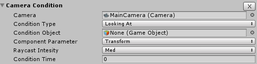

### Input Condition

This condition requires the user to either press or release a certain key to be met. Currently, only keyboard inputs are supported.

#### Component fields

**Input Key**: The key that needs to be interacted with to meet the condition.

**Trigger Type**: The type of interaction required. **OnPressed** requires the user to simply press the key down. **OnReleased** requires the user to release the key after pressing it.

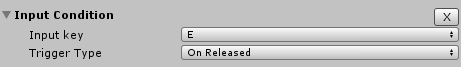

### Player Pref Condition

The player pref condition can be used to compare values stored in player prefs. For example, the player pref `LevelProgression` must have a value greater than `5` for this condition to be met. To use this condition, select the condition type, such as **greater than**, then enter the key of the player pref and finally the value that you want to compare that player pref with.

#### How does it work?

It's quite simple. The value in the player pref with playerPrefKey gets compared against `playerPrefValue` using the condition type. If you tick **Refresh Every Frame**, the value in the player pref will be retrieved every time the condition is checked. If you untick Refresh Every Frame, it will retrieve it once and cache it when you first start the game.

```csharp
playerPrefString = PlayerPrefs.GetString(playerPrefKey);
```

#### Component fields

**Condition Type**: The type of condition you want. Options are **greater than**, **greater than or equal to**, **equal to**, **less than or equal to**, or **less than**.

**Player Pref Key**: The key (ID) of the player pref that will be compared against the specified value.

**Player Pref Type**: The type of data stored within the player pref. Options are int, float, and string.

**Player Pref Value**: The value that will be used to compare against the value stored in the player pref.

**Refresh Every Frame**: If true, the value in the player pref will be retrieved every time the condition check happens. If false, it will only retrieve the player pref value once when the game first starts.

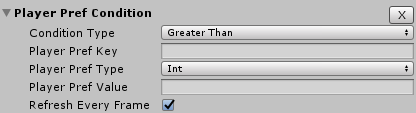

### Transform Condition

The transform condition can be used to compare the position or rotation of a transform against a value. For example, if an object's Y position is lower than a certain value.

#### Component fields

**Target Transform**: The transform to apply the condition to.

**Transform Component**: The transform component that will be used for the condition. Options are **Position** or **Rotation**.

**Target Axis**: The axis that the condition will be based on.

**Condition Type**: The type of condition you want. Options are **greater than**, **greater than or equal to**, **equal to**, **less than or equal to**, or **less than**.

**Value**: The value that will be compared against the value on the selected axis.

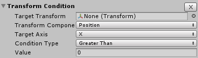

## Individual Responses

Below this, all of the current responses will be listed and described in detail. Once the trigger box is entered, all the conditions will be checked to see if they have been met. If all conditions have been met, all the responses will be executed.

### Animation Response

The animation response can be used to set a Mecanim trigger on a GameObject, stop all animations on a GameObject, or play an animation clip on a GameObject. You can either pass in a reference for a GameObject, supply a GameObject's name, or use the GameObject that triggered the box as a target for this response.

#### How does it work?

This response is quite self-explanatory, as it simply calls Unity animator functions. One thing to note is that when playing an animation clip, it will play the animation clip on the target animation over 0.3 seconds and will fade other animations out.

```csharp
if (stopAnim && animationTarget)
{
   animationTarget.GetComponent<Animation>().Stop();
}

if (animationClip && animationTarget)
{
   animationTarget.GetComponent<Animation>().CrossFade(animationClip.name, 0.3f, PlayMode.StopAll);
}

if (!string.IsNullOrEmpty(setMecanimTrigger) && animationTarget)
{
   animationTarget.GetComponent<Animator>().SetTrigger(setMecanimTrigger);
}
```

#### Component Fields

**Reference Type**: This is how you will provide the response access to a specific GameObject. You can either use a reference, a name, or the GameObject that collides with this trigger box.

**Animation Target**: The GameObject to apply the animation to.

**Animation Target** Name: If you cannot get a reference for a GameObject, you can enter its name here, and it will be found using `GameObject.Find()`.

**Set Mecanim Trigger**: The name of the trigger on the GameObject animator that you want to trigger.

**Stop Animation**: Stops the current animation on the animation target.

**Animation Clip**: The animation clip to play.

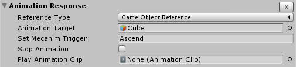

### Audio Response

The audio response can be used to play music, mute audio on the main camera, and play sound effects at any position. There is also the option to loop the music and change the volume of the music and sound effect.

The audio response can modify an audio source through actions such as playing an audio clip, stopping all audio, changing the volume, or restarting an audio clip. It can also be used to play sound effects at a specific position.

#### Component Fields

**Response Type**: The type of response that this component will be using. **AudioSource** allows you to modify an audio source, and **SoundEffect** allows you to play positional sound effects.

**Audio Source**: The audio source that will be modified.

**Audio Source Action**: The type of action to be performed on the audio source. Options include:

**Play**: Plays an audio clip.

**Stop**: Stops an audio source's currently playing clip.

**Restart**: Sets the time of the audio clip back to 0.

**Change Volume**: Sets the volume of the audio source.

**Audio Clip**: The audio clip that will be played on the audio source if the action selected is Play.

**Music Volume**: The volume of the audio clip when played. If the action is Change Volume, this is the volume that the audio source will be set to. Default is 1.

**Change Duration**: The duration over which the volume change will occur, in seconds. If you leave it as 0, it will perform the changes instantly. Only used if the action selected is Change Volume.

**Loop Music**: If true, the audio clip will loop when played if the action selected is Play.

**Play Sound Effect**: This is an audio clip played at a certain position in world space, as defined below.

**Sound Effect Position**: The position at which the sound effect will be played.

**Sound Effect Volume**: The volume of the played sound effect. Default is 1.

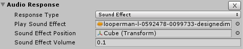

### Lighting Response

This response allows you to modify an individual light source or the scene's lighting settings. You can also apply your changes over a period of time.

#### Component Fields

**Edit Type**: Select whether you want to modify an individual light or the scene's lighting settings.

**Target Light**: The light that will be modified.

**Change Colour**: Choose to change the color of this light. Remain the same will not change the color.

**Set Colour**: The color that the target light will be set to.

**Set Intensity**: The intensity you want to set the target light to. If you leave this field blank, the light intensity will not be changed.

**Set Bounce Intensity**: The bounce intensity you want to set the target light to. If you leave this field blank, the light bounce intensity will not be changed.

**Set Range**: The range you want to set the target light's range to. If you leave this field blank, the range will not be changed. Only displayed when a spot or point light is selected.

**Set Skybox**: This is the material that you want to set the scene's skybox to. If you leave this field blank, the skybox will not be changed.

**Change Ambient Light Colour**: Choose to change the color of the scene's ambient light. Remain the same will not change the color.

**Ambient Light Colour**: The color that the scene's ambient light will be set to.

**Change Duration**: The duration over which the selected change will happen, in seconds. If you leave it as 0, it will perform the changes instantly.

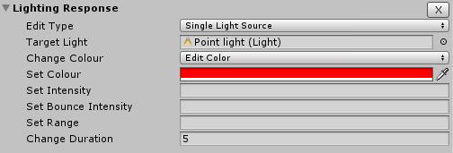

### Load Level Response

This response allows you to load or unload a scene, with options to either asynchronously or additively load a scene.

#### Component Fields

**Response Type**: The type of response that you want to be executed. Either loading or unloading a scene.

**Load Level Name**: The name of the scene you want to load. Depending on your Unity version, this may be the scene index instead of the name.

**Asynchronously**: Only available when loading a scene. If true, the scene will be loaded asynchronously. This means that the playing scene won't freeze as it loads the new scene on a background thread. If false, everything will freeze/wait until the new scene is loaded.

**Additive**: Only available when loading a scene. If true, the new scene will be displayed alongside the current scene. If false, the current scene will be unloaded.

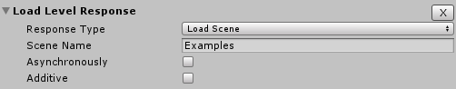

### Modify GameObject Response

This response allows you to modify a GameObject by either disabling, enabling, or destroying it. You can also enable/disable specific Unity components on a GameObject. You can either pass in a reference for a GameObject, supply a GameObject's name, or use the GameObject that triggered the box as a target for this response.

You cannot enable a GameObject by name because `GameObject.Find()` cannot be used on inactive objects. You also cannot disable or enable a Unity component without supplying a GameObject reference. It is good practice to use object references instead of searching for objects anyway.

```csharp
gameObject.SetActive(true);
gameObject.SetActive(false);
Destroy(gameObject);
```

#### Component Fields

**Reference Type**: This is how you will provide the response access to a specific GameObject. You can either use a reference, a name, or the GameObject that collides with this trigger box.

**GameObject**: The GameObject that will be modified.

**GameObject Name**: If you cannot get a reference for a GameObject, you can enter its name here, and it will be found using GameObject.Find().

**Modify Type**: This is the type of modification you want to apply to the GameObject. Options include:

- **Destroy**

- **Disable**

- **Enable**

- **Disable Component**

- **Enable Component**

**Select Component**: This is the Unity component on the GameObject that you want to enable/disable.

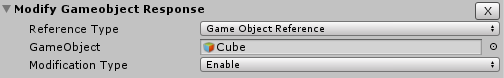

### Modify Rigidbody Response

This response allows you to modify any part of a Rigidbody component on another GameObject.

#### Component Fields

**Rigidbody**: The Rigidbody that will be modified.

**Set Mass**: Set the mass of this Rigidbody. If left blank, the value will not be changed.

**Set Drag**: Set the drag of this Rigidbody. If left blank, the value will not be changed.

**Set Angular Drag**: Set the angular drag of this Rigidbody. If left blank, the value will not be changed.

**Change Gravity**: Choose whether this Rigidbody should use gravity. Selecting Remain the same will not change the value, and selecting Toggle will invert the value.

**Change Kinematic**: Choose whether this Rigidbody is kinematic. Selecting Remain the same will not change the value, and selecting Toggle will invert the value.

**Change Interpolate**: Choose to set this Rigidbody to interpolate or extrapolate. Selecting Remain the same will not change the value.

**Change Collision Detection**: Choose to set this Rigidbody's collision detection between discrete or continuous. Selecting Remain the same will not change the value.

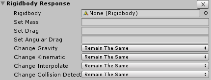

### Modify Transform Response

This response allows you to modify any part of a Transform component on another GameObject.

#### Component Fields

**Target Transform**: The transform that will be modified.

**Target Attribute**: The attribute of the transform that will be modified. Choose from Position, Rotation, or Scale.

**Target Axis**: The axis on which the selected attribute will be modified. Choose from X, Y, or Z.

**Local Space**: If checked, the modifications will be done in local space instead of world space.

**Target Value Type**: The type of value that the new value is. If it is Set, the transform value will be set to that value. If it is Additive, the transform value will be incremented by that value.

**Target Value**: The value you would like to set this attribute to.

**Change Duration**: The duration over which you want this change to happen. Leaving this at 0 will result in it happening instantly.

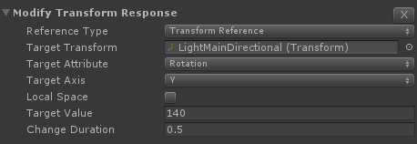

### Player Pref Response

This response allows you to save a value to a player pref. The supported data types are int, float, and string. If you're dealing with ints or floats, you can choose to increment or decrement the value by 1 by entering `++` or `--` in the value field.

```csharp
PlayerPrefs.SetString(setPlayerPrefKey, setPlayerPrefVal);
```

#### Component Fields

**Player Pref Key**: This is the key (ID) of the player pref that will have its value set.

**Player Pref Type**: This is the type of data stored within the player pref.

**Player Pref Value**: This is the value that will be stored in the player pref. If you enter `++` or `--`, the value in the player pref will be incremented or decremented respectively.

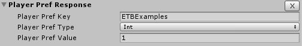

### Send Message Response

The send message response can be used to call a function on a select GameObject and pass in a parameter as well. Supported parameter types currently include int, float, and string. You can either pass in a reference for a GameObject, supply a GameObject's name, or use the GameObject that triggered the box as a target for this response.

#### How does it work?

The send message response uses Unity's built-in `GameObject.SendMessage()` function to send a value to a function on another GameObject. If you select int or float, it will parse the message value before sending it.

```csharp
messageTarget.SendMessage(messageFunctionName, int.Parse(parameterValue), SendMessageOptions.DontRequireReceiver);
```

#### Component Fields

**Reference Type**: This is how you will provide the response access to a specific GameObject. You can either use a reference, a name, or the GameObject that collides with this trigger box.

**Message Target**: This is the GameObject on which the below function is called.

**Message Target Name**: If you cannot get a reference for a GameObject, you can enter its name here, and it will be found using GameObject.Find().

**Message Function Name**: This is the function that is called on the above GameObject.

**Message Type**: This is the type of parameter that will be sent to the function. Options include int, float, and string.

**Message Value**: This is the value of the parameter that will be sent to the function.

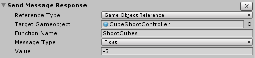

### Set Material Property

This response allows you to change a property within a material. The material can either be a material from a GameObject or a material in the project browser. Properties that can be changed include float, int, color, vector4, and texture. You can either pass in a reference for a GameObject, supply a GameObject's name, or use the GameObject that triggered the box as a target for this response.

#### Component Fields

**Reference Type**: This is how you will provide the response access to a specific GameObject. You can either use a reference, a name, or the GameObject that collides with this trigger box.

**GameObject**: The GameObject with the material you want to edit.

**GameObject Name**: If you cannot get a reference for a GameObject, you can enter its name here, and it will be found using GameObject.Find().

**Material**: A reference to the material that you want to set a property's value.

**Clone Material**: If true, the script will work with a clone of the material on this GameObject. If false, it will use the original material in the project directory. **WARNING**: If false, it will permanently change that material's values.

**Material Property Name**: The name of the property that you want to set.

**Material Property Type**: The type of the property that you want to set. Options include Float, Int, Colour, Vector4, or Texture.

**Material Property Value**: The new value of this property.

**Change Duration**: The duration over which you want this change to happen. Leaving this at 0 will result in it happening instantly.

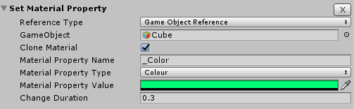

### Spawn GameObject Response

This response allows you to spawn a GameObject at any given position. You can also optionally change the name of the newly spawned GameObject.

#### Component Fields

**Prefab to Spawn**: This is a reference to the prefab that will be instantiated (spawned).

**New Instance Name**: This field is used to set the name of the newly instantiated object. If left blank, the name will remain as the prefab's saved name.

**Custom Position / Rotation**: This is the position and rotation the prefab will be spawned with. If left blank, it will use the prefab's saved attributes.

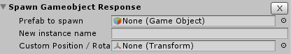

### Teleport Response

This response simply allows you to move GameObjects from one point to another. You can either pass in a reference for a GameObject, supply a GameObject's name, or use the GameObject that triggered the box as a target for this response.

#### Component fields

**Reference Type**: This is how you will provide the response access to a specific GameObject. You can either use a reference, a name, or the GameObject that collides with this trigger box.

**Target GameObject**: This is the GameObject that you want to move.

**Target GameObject Name**: If you cannot get a reference for a GameObject, you can enter its name here, and it will be found using `GameObject.Find()`.

**Destination**: This is the position you want to move the GameObject to.

**Copy Rotation**: If this checkbox is ticked, the target object's rotation will be set to the destination's rotation.

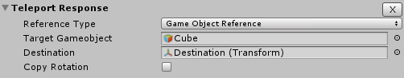

## Troubleshooting

#### System.Reflection.ReflectionTypeLoadException: The classes in the module cannot be loaded.

Enhanced Trigger Box uses .NET Reflection to obtain information about loaded assemblies and the types defined within, in this case being the enhanced trigger box components. If you see this error, it means your Unity API is set to a .NET version that doesn't support Reflection. To fix this, go to **Edit > Project Settings > Player > Other settings** and set **Api Compatibility Level** to **.NET 2.0** instead of **.NET 2.0 Subset** and then reload your project.

#### Error building Player because scripts had compiler errors

This is a bug found when attempting to build a project that has been resolved as of v0.1.3.

If you are upgrading from a version lower than v0.1.3 and have created any custom Enhanced Trigger Box Components, you will need to make some changes to them. First, go to your new component and at the top remove using UnityEditor;. Then, scroll down to the DrawInspectorGUI() function. You will most likely have a few errors. These can be fixed by putting UnityEditor. in front of them. Finally, above the DrawInspectorGUI() function add #if UNITY_EDITOR and beneath the function put #endif. If you have imported the updated package, you can look at the other updated components for guidance.

#### Variable values not being saved correctly in custom components

This is a vague issue, so there could be a multitude of reasons why it isn't saving. One recommendation is to check that all the variables are public and not private. This has solved a similar problem for me in the past and could be the solution to your problem.

#### Base ExecuteAction(GameObject collisionGameObject) being called instead of the overridden version

This is caused by `requiresCollisionObjectData` being set to false and the `ExecuteAction()` version without the GameObject references being called, which you most likely haven't implemented. To fix this, simply set `requiresCollisionObjectData` to true in your component.

## Misc

Audio file used in demo/examples scene obtained from [here](http://www.looperman.com/loops/detail/99733/piano-loop-reflections-of-life-70-by-designedimpression-free-70bpm-ambient-piano-loop) and is licensed under the Creative Commons 0 License.

The background image used on the asset store and this website is found [here](http://wonderfulengineering.com/37-programmer-code-wallpaper-backgrounds-free-download/).

The project itself is licensed under MIT license and you are free to do with it what you want.
